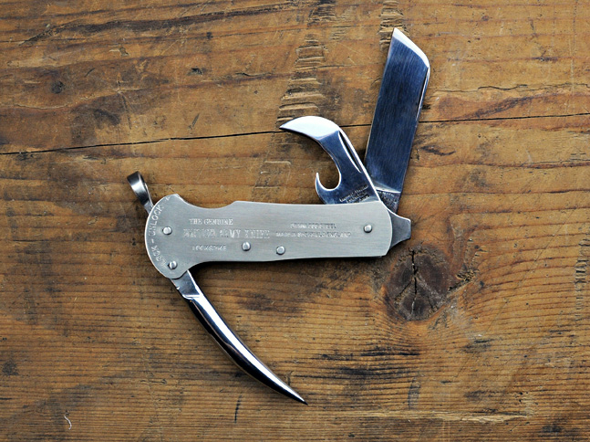
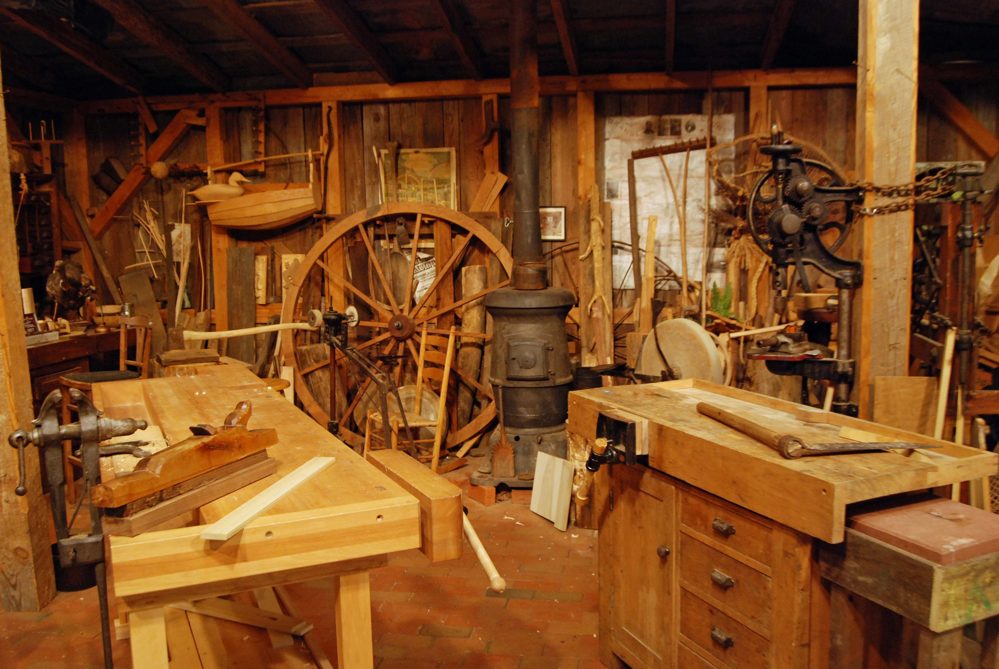
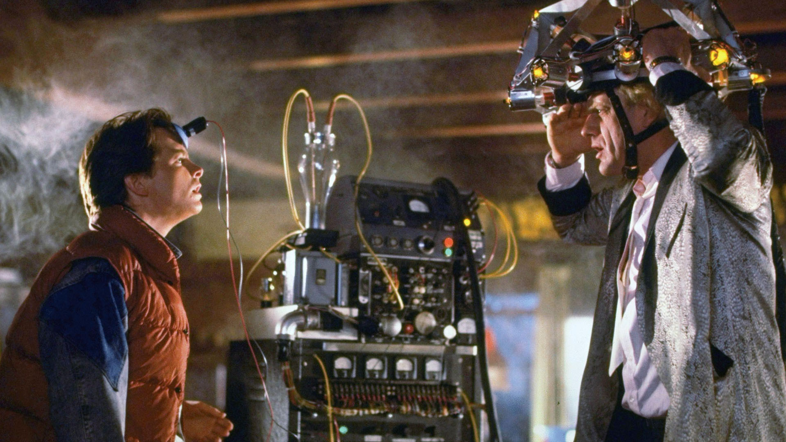
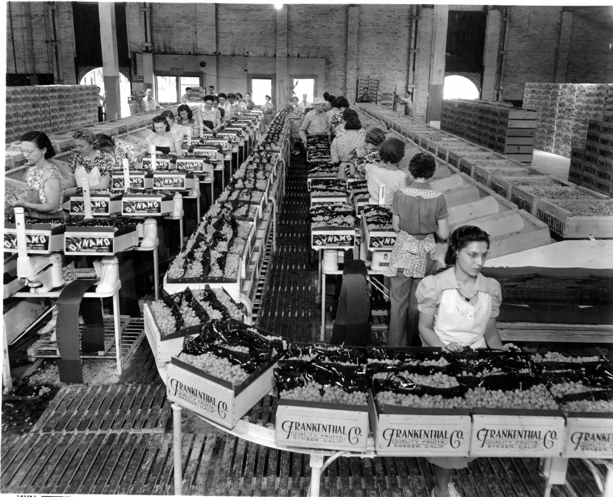

autoscale: true
footer: CHEF DAW, 2015
slidenumbers: true

# [fit] DevOps Acceleration Workshop

---

## Activity 1 - Constellation Questions

+ I believe this workshop will be valuable.
+ When stressed, I like to be given clear directions.
+ When stressed, I like to create order.
+ I have a clear vision of how DevOps will unlock my awesome.

^ Opening exercise, begins when group assembles. We will do intros and working agreements after self-organising.

---

# Justin Arbuckle
## VP EMEA, Chief Enterprise Architect
### @dromologue / ja@chef.io

# Jeff Hackert
## Director Learning and Development
### @jchackert / jhackert@chef.io / spacemonkeypants (LoL)

---

## What's the Big Idea?

+ DevOps is a union of tools, practices and culture.
+ Software development is new product development.
+ Learning is the _*only*_ competitive advantage.
+ Strategy is conversation.

---

## What to Expect.

+ Overview of the new world.
+ A Quick history from Ohno to DevOps (and back?).
+ Aquire tools for working in the new way - Lean/Agile/CD.
+ Identify an MVP for a project you can deliver in 6 weeks (product and practice).
+ Iteratively and incrementally build our product pitch.
+ Identify areas of waste, blockages or frustration in your current practise...
+ Remediate these within the project by evolving your practise;

---

# Your _capability to build will improve continually_ as you deliver value to the customer.

---

## Agenda Day One

+ _*Opening & Working Agreements*_
+ _*Brave New World I*_  
+ _*Brave New World II*_
+ _*Back to the Future*_
+ _*Closing*_

^ Introductions, who are you? what team?, what value?

---

# Working Agreements

^Go over breaks, cell phone and laptop use, how we will engage with each other, etc.
Write on a flip chart, do this every day

---

# Episteme & Technae

^
+ Tools are awesome. DevOps is not just about tools.
+ Knowing your craft and being part of a movement gets the most out of them.
+ You're not in the middle of a tool revolution... you're in the middle of a _craft_ revolution.

---

^Learning outcome --> Understand the impact of organizational structure on performance, quality and innovation.

# Conway's Law

^
+ org structure is history not strategy
+ Silos beget Supervisors, Supervision without context makes you slow and stupid.
+ Move to Metcalf! What is your Dunbar number?
+ Small, entrepreneurial teams have context for defining quality and 'done'.

---

# Activity 2 - Conway's Law

^ In your teams, discuss some examples of how you see Conway's Law at work in your organisation.

---

# Brave New World

^
+ 21st Century Work --> Pragmatist hacker ethos
+ software is eating the world
+ Velocity is the new Hedgehog.
+ Compliance is the new fox.

---

# What _exactly_ is DevOps?

^
+ From Ohno, to Agile, to now
+ Automate all the things, discuss the rest
+ 2 wizards (results/rational, pluralistic/humanist) in your Org
+ it's the people, stupid! - the pedagogic function of your team is your business value
+ Kaizen/Kaikaku
+ Lean Teams

---

# The Game of Triangles

^Secretly pick two friends. Move around the room so that you and your two friends form the points of an equilateral triangle. Continue until everyone stops moving.
Debrief: What did that feel like? What would that have been like if you could only move when and where your manager tells you to?

---

# Talking to Customers

^ product + practise.
Customer interviews - go over validating your assumptions - foreshadowing day 2

---

# The Two Product Principle

^ Kaizen improvements e.g. automate infrastructure, increase test coverage & Customer Value
Solving one customer problem while building your capacity to improve...

---

# Activity 3 - The Remember the Future Game

^ dot rank attributes to become target conditions

---

# Day 2

---

## Agenda Day Two

+ _*Opening & Working Agreements*_
+ _*The Crucible (Building The Holy Shit Moment MVP)*_
+ _*Continuous & Generative Improvement*_
+ _*Closing*_

---

# Working Agreements

^Go over breaks, cell phone and laptop use, how we will engage with each other, etc.
flip chart

---

# A Holy Shit Moment

---

# Resolving Theory with Action

^
+ Specializing generalists
+ Scale is not your problem

---

# IOTA
## Building a J2 Product Sheet

---

# The Crucible  - Set Up
## ROAR (Rest, Orient, Act, Reflect)

+ 4 rounds of crucible
+ 15 minutes reflection
+ 1 and 15mins content
+ 15 minute break

^ IOTA Model, ROAR (Rest 5mins, Orient 5mins, Act 3mins (it's on the J2, ready to ship), Reflect 2mins)
collect J2 sheets from each team at the end - teams must build new J2s with each iteration

---

# The Crucible  - Round 1

^ 4 rounds of ROAR

---

# The Maker Cycle - Generative Change
^
+ Consistency
+ Velocity
+ Scale

^ Autopoiesis

---

# The Crucible  - Round 2

^ 4 rounds of ROAR

---

# High Performance Teams

^This is where we get real about team interactions, because we are about to send them into the crucible. Lean Principle of Respect for people (Humanity), the 'why' of respect. The #hugops (Justin hates 'hugops') conversation.
Operating Chasm
ELSA
The closer you are to the line of execution the more difficult it is.
+ 4 player model
+ 6 thinking hats
+ Satir Change Model

---

# The Crucible  - Round 3

^ 4 rounds of ROAR

---

# Day 3

---

## Agenda Day Three

+ _*The Crucible (Refining The Holy Shit Moment MVP)*_
+ _*Presentations*_
+ _*Retrospective*_
+ _*Closing*_

---

# Working Agreements

---

# The Crucible  - Round 1

---

# The Crucible  - Round 2

---

# Stances

^ facilitation, training, mentorship, coaching

---

# Coaching Cohort and Community of Practice

---

# The Crucible  - Round 3

---

# Presentations

^ Prep, Rehearse, Deliver (1 hr)

---

# Retrospective

---

# Errata

---
> precisely specify value by specific product... make value flow without interruptions, let the customer pull value from the producer, and pursue perfection.
-- Womack & Jones

^Quote Slide - put it up during an exercise

---

> Our highest priority is to satisfy the customer through early and continuous delivery of valuable software.
-- Agile Principles

^Quote Slide - put it up during an exercise

---

> The longer it takes to get feedback the greater the effort required to make the change.
-- Someone Special

^Quote Slide - put it up during an exercise

---

> We convert fear into joy through surprise
-- anon

^ the power of adaptive learning

---

## 6 Thinking Hats

+ White - Data, Facts, Information - Rational
+ Red - Feelings, hunches - Intuitive
+ Black - Difficulties and potential Problems - Concern
+ Yellow - Values and benefits - The Why
+ Green - creativity, possibility, outcomes - Aspiration
+ Blue - next steps, actions, plans - Process

---

# 4 Player Model

^
+ Bystand
+ Move
+ Oppose
+ Follow

---

^Break slide, put it up during breaks
