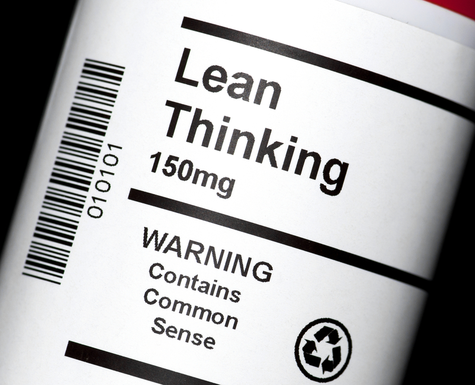
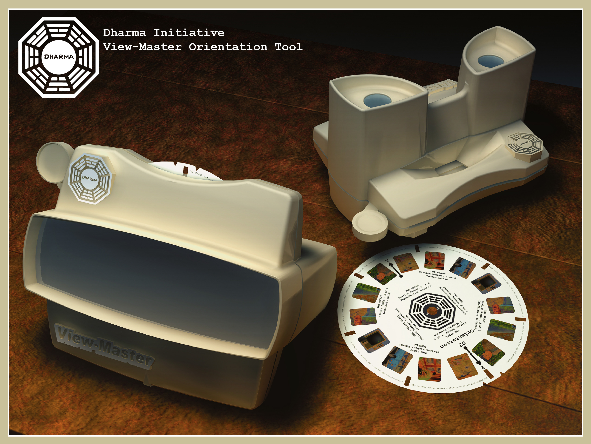

# [fit] DevOps Acceleration Workshop
# [fit] Fueling the Love of Continuous Delivery

---

# Justin / Jeff
## VP EMEA/ Director L&D
### @drmologue/@jchackert / ja@chef.io/jhackert@chef.io / spacemonkeypants (LoL)

---
#Agenda

- _*Set Working Agreement*_
- _*Module 1 Conway's Law (Hacker)*_
- _*Module 2 Brave New World (anticipating the outcome)*_
- _*Module 3 Stop Shipping Your Org Chart!*_
- _*Module 4 The Automation Cycle (seizing the means of production)*_
- _*Module 5 Transformation (Horses and Unicorns)*_
- _*Module 6 The Crucible (The HSM MVP)*_

---

# [fit] Working Agreements

---
## Module 1

# [fit] Conway's Law

---

---
> precisely specify value by specific product, identify the value stream for each product, make value flow without interruptions, let the customer pull value from the producer, and pursue perfection.
-- Womack & Jones

---
> Our highest priority is to satisfy the customer through early and continuous delivery of valuable software.
-- Agile Principles

---
> The longer it takes to get feedback the greater the effort required to make the change.
--- Someone Special

---
# [fit] Eliminate Waste

---
# [fit] ‘Muda‘ (unproductive)
# [fit] ‘Mura‘ (unevenness, inconsistency)
# [fit] ‘Muri‘ (over-burden, unreasonableness)

---
- Over-production
- Unnecessary transportation
- Inventory
- Motion
- Defects
- Over-processing
- Waiting

---
- unnecessary code or functionality
- starting more than can be completed
- delay in the software development process
- slow, poor or ineffective communication
- partially done work
- defects and quality issues
- task switching

---
# [fit] Build Quality In

---
- The Rule of 4 Eyes (pairing & code revew)
- Testing (unit, functional, integration)
- Constant Feedback - Orient, Experiment, Reflect
- Minimize Time Between Stages
- Continuously Deliver
- Automate All the Things
- Manage the trade-offs between Quality, Time, and Scope

---
# [fit] Create Knowledge

---
# [fit] Optimize for Learning!

---
# Culture Debt > Technical Debt

---
Communities of Practice

---

# [fit] Defer Commitment

---
# [fit] Continuously Deliver

---
# [fit] Respect People

---

> Kindness requires no justification, no business case, and no corporate sponsor.
-- Hackert

---
# [fit] Optimize the Whole

---

# [fit] Orient - Experiment - Reflect

---
# [fit] Complex Adaptive Systems

---
## Module 2

# Brave New World (anticipating the outcome)

---
# [fit] What is a team?

---
# Shall We Play a Game?

---
# [fit] Psychological Safety

---

---

# [fit] Knowledge, Safety, Freedom, Contentment

---
# [fit] Safe to Fail

---
## Module 3

# Stop Shipping Your Org Chart!

---
# [fit] Kanban 101

---
> "A late change in requirements is a competitive advantage".
-- Mary Poppendieck

---

> "Only if you can act on them"
-- Hackert

---
# [fit] WIP

---
- _*Unimplemented Spec/Design*_
- _*Un-Reviewed Code*_
- _*Un-Tested and Un-reviewd Code*_
  - Peer Code Review
  - Unit Tests
  - Integration Tests
  - A/B - Customer Testing
  - _*Code not in Production*_

---
# [fit] Little's Law

---
# [fit] Blameless Post Mortem

---
- what actions were taken and when
- what effects were observed
- what expectations were held
- what assumptions
- an understanding of timeline of events as they occurred.

---

## Module 4

# The Automation Cycle (seizing the means of production)

---
## Module 5

# Transformation (Horses and Unicorns)

---

^ we do not want to forage

---
## Module 6

# The Crucible (The HSM MVP)

---
## Collaboration

is not:
- 1 solution found by 1 person
is:
- Orientation
- developing hypothesis
- Finding causes
- Testing causes

---
We Want to:
- Explore options
- Efficiently find potential solutions
- Balance thinking and action
- Use the collective wisdom of the team
- Kill problems dead - no zombies

---

---

## Understanding is Emergent
- Arrive at a shared conclusion based on options and not engage in premature convergence.
- Avoid analysis paralysis through diverse ideation, social investigation, and robust solution(s) development.

---

# [fit] Errata

---

