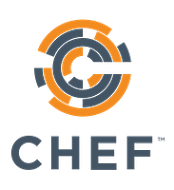
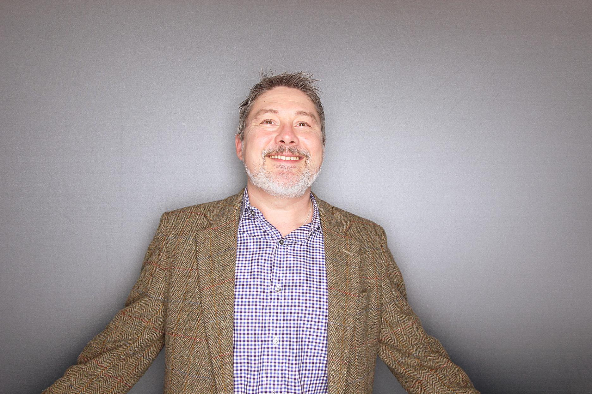
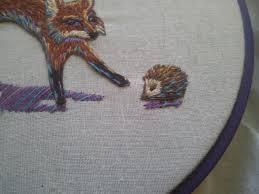
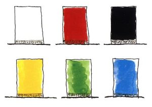
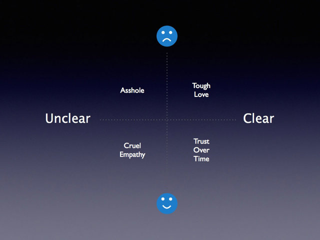
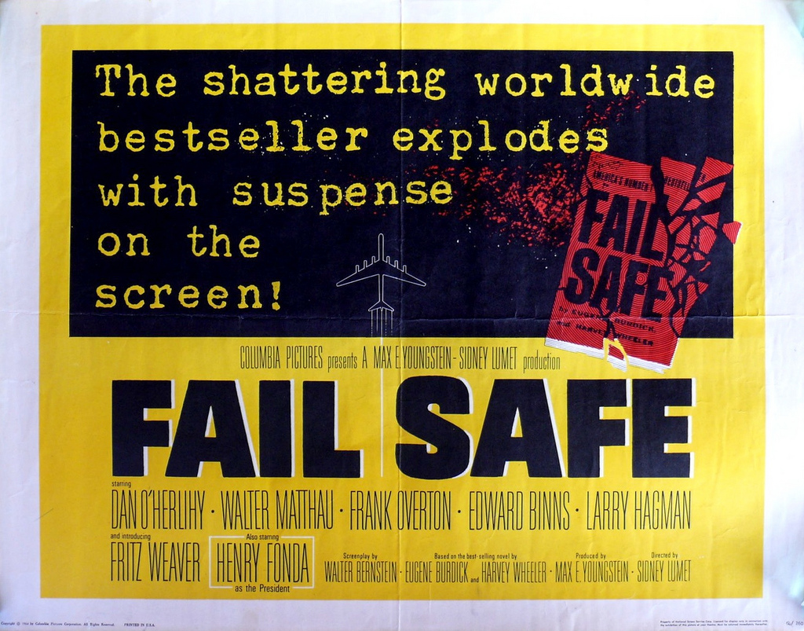
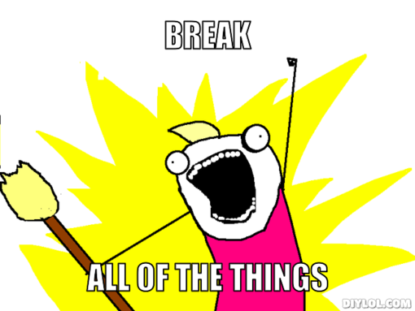

# [fit] 21st Century Craft Workshop
# [fit] Harvesting Meaningful Organisational Change from Technology

---

# Justin Arbuckle
## VP EMEA, Chief Enterprise Architect
### @dromologue / ja@chef.io

# Jeff Hackert
## Director Learning and Development
### @jchackert / jhackert@chef.io / spacemonkeypants (LoL)

---
# Big Idea

+ All product development is software development.
+ Software makes and shapes new markets. Continually.
+ Learning is the only competitive advantage.

---

# Agenda

- _*Opening*_
- _*Conway's Law*_
- _*Brave New World (anticipating the outcome)*_
- _*Stop Shipping Your Org Chart!*_
- _*The Automation Cycle (seizing the means of production)*_
- _*Transformation (Horses and Unicorns)*_
- _*The Crucible (Building The Holy Shit Moment MVP)*_
- _*Closing*_

---

# [fit] Working Agreements

^Go over breaks, cell phone and laptop use, how we will engage with each other, etc.
^flip chart

---

## Constellation Questions
+ I believe this workshop will be valuable.
+ When stressed, I like to be given clear directions.
+ When stressed, I like to create order.
+ I have a clear vision of how DevOps will unlock my awesome.

---
^Module 1

# Conway's Law

+ Silos beget Supervisors, Supervision without context makes you slow and stupid.
+ Move to Metcalf! What is your Dunbar number?
+ Small, entrepreneurial teams have context for defining quality and 'done'.

---

## Triangle - Game

^Secretly pick two friends. Move around the room so that you and your two friends form the points of an equilateral triangle. Continue until everyone stops moving.

^Debrief: What did that feel like? What would that have been like if you could only move when and where your manager tells you to?

---
^Module 2

# Brave New World
^(anticipating the outcome)

+ 21st Century Work --> Pragmatist hacker ethos
+ software is eating the world
+ Velocity is the new Hedgehog.
+ Compliance is the new fox.

---

# A Quick history of LEAN, Agile and what _exactly_ is DevOps?

+ Small batches
+ Unmet Needs
+ Action resolves theory

---

# Stop Shipping Your Org Chart!

^Module 3 - Product, not organization

---

Product - Customer focused
Specializing generalists
Communities of practice

---

> "A late change in requirements is a competitive advantage".
-- Mary Poppendieck

---

> "But only if you can act on it!"
-- Yoda

---

## Remember the Future - Game

---

# The Automation Cycle (seizing the means of production)

^Module 4

---

2 wizards (results, pluralistic) in yer Org
automate all the things, discuss the rest
it's the people, stupid! - the pedagogic function of your team is your business value
velocity/consistency(coherence)/scale
Scale is not your problem
Kaizen/Kaikaku

---

# Transformation (Horses and Unicorns)

^Module 5 - This is where we get real about team interactions, because we are about to send them into the crucible. Lean Principle of Respect for people (Humanity), the 'why' of hugops

---

## 6 Thinking Hats

- White - Data, Facts, Information - Rational
- Red - Feelings, hunches - Intuitive
- Black - Difficulties and potential Problems - Concern
- Yellow - Values and benefits - The Why
- Green - creativity, possibility, outcomes - Aspiration
- Blue - next steps, actions, plans - Process

---

## 4 Player Model

---

> Kindness requires no justification, no business case, and no corporate sponsor.
-- Dumbledore

---

# [fit] Culture Debt > Technical Debt

---

---

# Build A Holy Shit Moment MVP

^Module 6

---

> We convert fear into joy through surprise
-- anon

^ the power of adaptive learning

---
## Collaboration
is not:
- 1 solution found by 1 person
is:
- Orientation
- developing hypothesis
- Finding causes
- Testing causes

---
We Want to:
- Explore options
- Efficiently find potential solutions
- Balance thinking and action
- Use the collective wisdom of the team

---

# 5/2/2

## team work, retrospective, rest

^Crucible - Run a timer for your teams

---

# Safe to Fail
# Quick to Recover

---

# [fit] Errata

---
> precisely specify value by specific product, identify the value stream for each product, make value flow without interruptions, let the customer pull value from the producer, and pursue perfection.
-- Womack & Jones

^Quote Slide - put it up during an exercise

---
> Our highest priority is to satisfy the customer through early and continuous delivery of valuable software.
-- Agile Principles

^Quote Slide - put it up during an exercise

---
> The longer it takes to get feedback the greater the effort required to make the change.
-- Someone Special

^Quote Slide - put it up during an exercise

---

# Shall We Play a Game?

^Excercise Slide, put it up during

---

^Break slide, put it up during breaks
