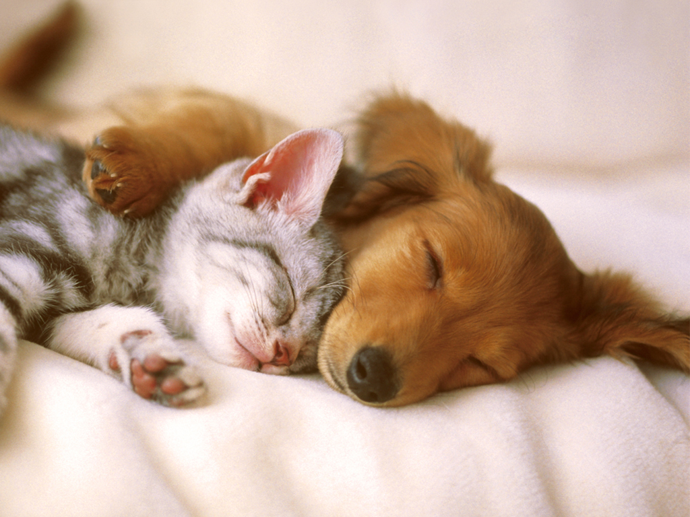
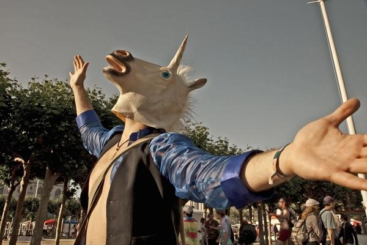

autoscale: true
footer: CHEF/Gamestop 1-Day DTI, 2015-2016
slidenumbers: true

^ Style guide:
Use sketchnote yellow theme in Deckset
New Slides begin with  \n---\n
Main sections are single hash.
Sub sections are double hash.
talking points are listed on the slides as +
Additional concepts and detail are linked within the slides. see [Link Example](/linkexample.md)
We create an agenda separately from this file as it changes with every session (which is ok).
5 kinds of slides... Structure, Content, Activity, Concepts, Tools --> Each have a common layout and structure.
Talking points are now visible on the slides. We don't refer to the slides, they're just backgrounds and the text wont distract. Also - it allows us to easily send out a PDF of the slides with some actual content.

# [fit] DevOps Transformation

---

Jeff Hackert
Director Learning and development - CHEF
@jchackert / jhackert@chef.io / spacemonkeypants (LoL)

---

## Agenda
+ Old man yacks for 90ish minutes
+ Break
+ Old man yacks more, sometimes we yack back
+ Break for lunch
+ More yacking
+ Done

---

## What's the Big Idea?

+ Overview of the new world.
+ History of DevOps (Agile, Lean, Continuous Delivery).
+ Software development is new product development.
+ Learning is your _*only*_ competitive advantage.
+ Aquire tools for working in the new way - Lean/Agile/CD.
+ Practice, practice, praxis

---

## Activity - If I could change one thing...

---

# Why change?
^ Change is hard, so don’t be a %$! about it!

---

# A history of DevOps in 5 minutes

^Use the history of DevOps and the direction of the movement as the frame for the following points

---

## 6 Causes with 1 result

+ Silos beget supervision
+ Learning is the only competitive advantage
+ Stop shipping your org chart
+ Automate everything, discuss the rest
+ It's the people, stupid!
+ Practice
+ Transformation!

---

## 1 - Silos beget supervision, supervision begets process.

^ Your organization's structure is the product of its communication history (Conway’s Law). Cross functional teams
organize for Metcalf's, not Conway's

---

## 2 - Learning is your only competitive advantage.

---

## Activity - How is learning valued at Gamestop?

^on your teams, at the line of execution

---

## 3 - Stop anticipating the outcome (seek validation)

---

## 2 Product principle

---

## 3 - Stop shipping your org chart!

^(Product alignment, not functional alignment.)

---

## Activity - How do we understand and communicate value?

^discussion

---

## Cattle, not pets

^No snowflakes! - (Example -> CloudInit is not configuration management. Use cloud init for just one task: to bootstrap the Chef agent. You can write top to bottom run once CloudInit scripts to provision a server. But what happens when you need to change a configuration file, add a user, update a package, or install a new package?) - HROs  (let your experts define the)

---

## 4 - Automate everything, discuss the rest.

---

## Adopt low friction technology paths.
^Practices (automation, workflow, CD)

---

## 5 - Meet people where they are.  

^reprise on Silos and Conway to seal the idea

---

## Have empathy for the people that do the work.

---

## Activity - Empathy? WTF?

^on your teams, at the line of execution

##Let go of organizational delusion.

---

## 6 - It’s not the words, it’s the things we do.

^ DTW Pitch

---

## Create ‘Holy Shit Moments’

^ and support them with community.

---

# ELSA Model

---

# Transformation!

---
